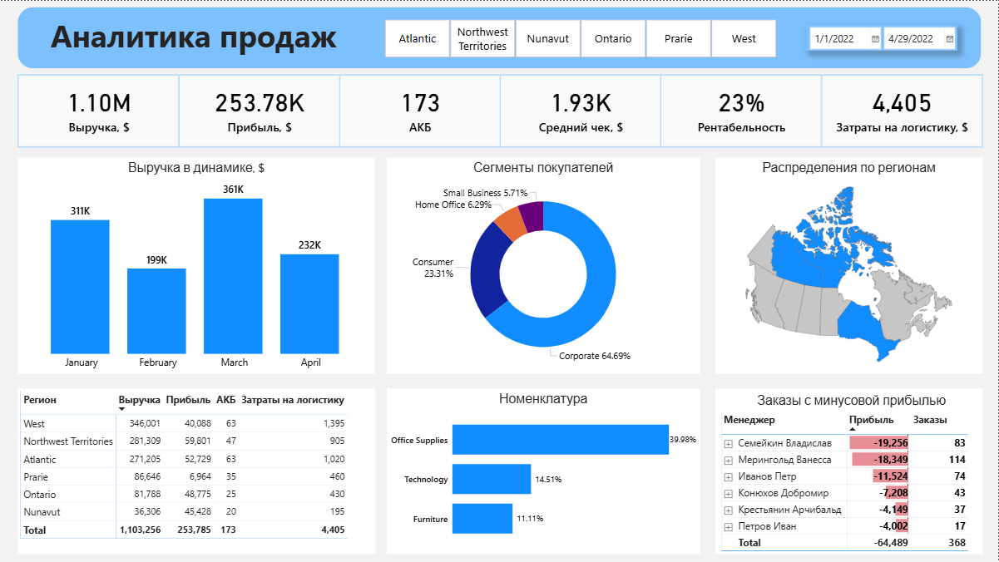
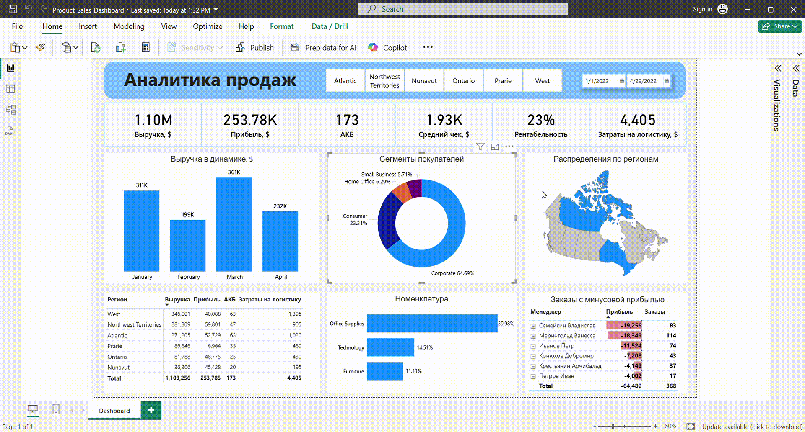
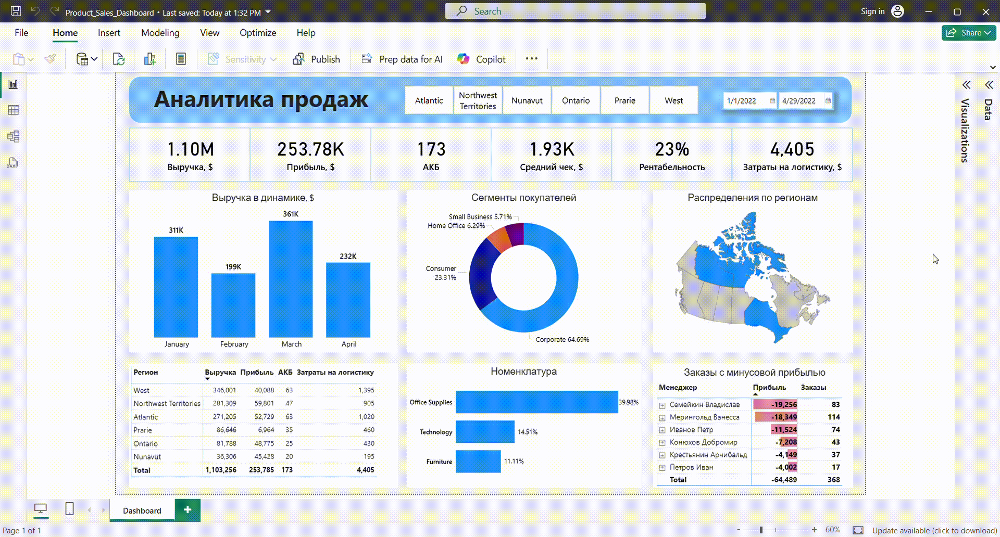

<h2>1. Название проекта</h2>

Product Sales Daschboard

<h2>2. Описание проекта</h2>

Данный дашборд предназначен для мониторинга ключевых бизнес-показателей компании, которая занимается продажей оборудования для оснащения офиса. Он объединяет финансовые, операционные и маркетинговые метрики для комплексного анализа деятельности.

  <strong>Ссылка на проект</strong>
   
  <a href='Product_Sales_Dashboard.pbix'>Sales Dashboard</a>

<h2>3. Цели дашборда:</h2>
<ol>
  <li>Обеспечить быстрый доступ к ключевым бизнес-показателям для оперативного принятия решений.</li>
  <li>Отслеживать динамику продаж и прибыли во времени для выявления трендов и сезонных изменений.</li>
  <li>Анализировать эффективность сегментов клиентов и регионов, чтобы оптимизировать маркетинговые стратегии.</li>
  <li>Контролировать затраты, особенно логистические расходы, для повышения рентабельности.</li>
  <li>Обнаруживать убыточные заказы и управлять ими для снижения потерь.</li>
  <li>Поддерживать стратегическое планирование на основе данных о товарных группах и регионах.</li>
</ol>
<h2>4. Основные разделы и визуализации</h2>
<ul>
  <li>
    <h3>Карточки KPI.</h3>
    
Быстрый обзор ключевых показателей эффективности:

      <ol>
        <li type='1'>Выручка</li>
        <li type='1'>Прибыль</li>
        <li type='1'>Активная Клиентская База (АКБ)</li>
        <li type='1'>Средний чек</li>
        <li type='1'>Рентабельность</li>
        <li type='1'>Затраты на логистику</li>
      </ol>
  </li>
  <li>
    <h3>Динамика по времени (Bar Chart).</h3>
    
Отображает изменение показателей по неделям, месяцам и годам, что позволяет отслеживать тренды и сезонные колебания.

    
  </li>
  <li>
    <h3>Анализ сегментов покупателей (Donut Chart).</h3>
    
Визуализация по сегментам клиентов помогает понять, какие группы приносят больше дохода или требуют внимания.

    
  </li>
  <li>
    <h3>Распределение по регионам (Map).</h3>
    
Карта показывает объем продаж, прибыль или другие метрики по регионам, что помогает выявить наиболее прибыльные или проблемные регионы.

    
  </li>
  <li>
    <h3>Выручка, прибыль, АКБ и затраты на логистику по регионам (Table).</h3>
    
Детальный анализ региональных показателей помогает принимать стратегические решения по развитию или корректировке маркетинговых усилий

    
  </li>
  <li>
    <h3>Анализ товаров по номенклатуре (Bar Chart).</h3>
    
Распределение продаж и прибыли по ассортименту позволяет определить наиболее популярные или рентабельные товары.

    
  </li>
  <li>
    <h3>Заказы с минусовой прибылью по менеджерам (Table).</h3>
    
Отдельный раздел показывает заказы, которые убыточны, что важно для оптимизации работы менеджеров и снижения потерь.

    
  </li>
</ul>
<h2>5. Решения, предлагаемые дашбордом:</h2>
<ol>
  <li>Быстрый мониторинг финансовых результатов в реальном времени.</li>
  <li>Выявление наиболее прибыльных сегментов клиентов и регионов.</li>
  <li>Анализ сезонных трендов для планирования закупок и маркетинговых кампаний.</li>
  <li>Контроль затрат на логистику с целью их оптимизации.</li>
  <li>Обнаружение убыточных заказов для их последующего анализа и корректировки работы менеджеров.</li>
  <li>Поддержка принятия решений о расширении или сокращении ассортимента товаров на основе анализа номенклатуры.</li>
</ol>
<h2>6. Этапы проекта:</h2>
<ol>
  <li>
    <h3>Анализ требований и целей</h3>
    <ul>
      <li type='disc'>Провела встречи с заинтересованными сторонами для определения ключевых бизнес-показателей и целей дашборда.</li>
      <li type='disc'>Определила основные метрики: выручка, прибыль, рентабельность, затраты на логистику, средний чек и другие KPI.</li>
      <li type='disc'>Выяснила потребности в детализации данных: по регионам, сегментам клиентов, товарам, времени.</li>
    </ul>
  </li>
  <li>
    <h3>Сбор и интеграция данных</h3>
    <ul>
      <li type='disc'>Собрала данные и объединила данные в единую модель для обеспечения целостности анализа.</li>
    </ul>
  </li>
  <li>
    <h3>Очистка и подготовка данных</h3>
    <ul>
      <li type='disc'>Провела очистку данных: удаление дубликатов, исправление ошибок, заполнение пропущенных значений.</li>
      <li type='disc'>Стандартизировала форматы дат, валют и категорий для унификации данных.</li>
      <li type='disc'>Создала дополнительные вычисляемые поля (прибыль по заказу, сегменты клиентов).</li>
    </ul>
  </li>
  <li>
    <h3>Агрегация и моделирование данных</h3>
    <ul>
      <li type='disc'>Создала сводные таблицы и агрегированные показатели по времени (месяцам, неделям, годам).</li>
      <li type='disc'>Построила связи между таблицами (товары — заказы — клиенты — регионы) для поддержки аналитики.</li>
    </ul>
  </li>
  <li>
    <h3>Разработка расчетных мер и визуальных элементов</h3>
    <ul>
      <li type='disc'>Настроила меры (measures) в Power BI для отображения KPI: выручки, прибыли, рентабельности и т.д.</li>
      <li type='disc'>Создала визуализации: карточки KPI, бар-чарты для динамики по времени, донат-чарты по сегментам покупателей и другие графики.</li>
    </ul>
  </li>
  <li>
    <h3>Настройка интерактивности и фильтров</h3>
    <ul>
      <li type='disc'>Добавила срезы (slicers) по времени, регионам, сегментам клиентов и товарам для удобства анализа.</li>
      <li type='disc'>Обеспечила возможность детализировать данные при помощи drill-down и фильтров.</li>
    </ul>
  </li>
  <li>
    <h3>Тестирование и финальная проверка</h3>
    <ul>
      <li type='disc'>Проверила корректность отображения данных на дашборде.</li>
      <li type='disc'>Сравнила показатели с исходными системами для подтверждения точности.</li>
    </ul>
  </li>
</ol>
